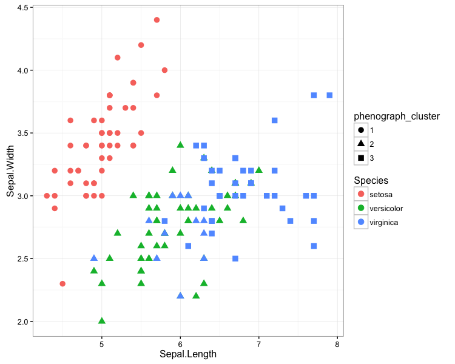

R implementation of the PhenoGraph algorithm
===============

### Rphenograph

A simple R implementation of the [PhenoGraph](http://www.cell.com/cell/abstract/S0092-8674(15)00637-6) [1] algorithm, which is a clustering method designed for high-dimensional single-cell data analysis. It works by creating a graph ("network") representing phenotypic similarities between cells by calclating the Jaccard coefficient between nearest-neighbor sets, and then identifying communities using the well known [Louvain method](https://sites.google.com/site/findcommunities/) in this graph. 


### Installation

To install the latest version from the github repository, use:

``` r
if(!require(devtools)) 
install.packages("devtools") # If not already installed
devtools::install_github("JinmiaoChenLab/Rphenograph")
```


### Usage

After installing the package, use the following code to run a simple example (to install, see below).

``` r
iris_unique <- unique(iris) # Remove duplicates
data <- as.matrix(iris_unique[,1:4])
Rphenograph_out <- Rphenograph(data, k = 45)
modularity(Rphenograph_out[[2]])
membership(Rphenograph_out[[2]])
iris_unique$phenograph_cluster <- factor(membership(Rphenograph_out[[2]]))
ggplot(iris_unique, aes(x=Sepal.Length, y=Sepal.Width, col=Species, shape=phenograph_cluster)) + geom_point(size = 3)+theme_bw()

```



### Reference

[1] Levine JH, Simonds EF, Bendall SC, Davis KL, Amir ED, Tadmor MD, et al. Data-Driven Phenotypic Dissection of AML Reveals Progenitor-like Cells that Correlate with Prognosis. Cell. Elsevier Inc.; 2015; 1–14. doi:10.1016/j.cell.2015.05.047


